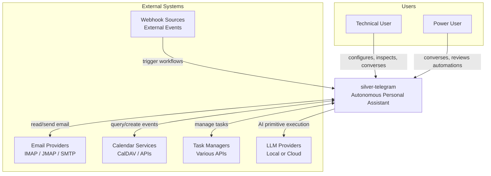
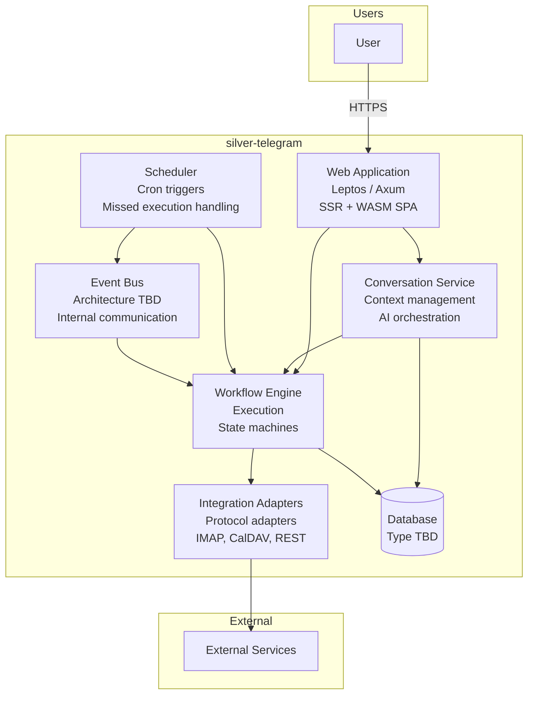
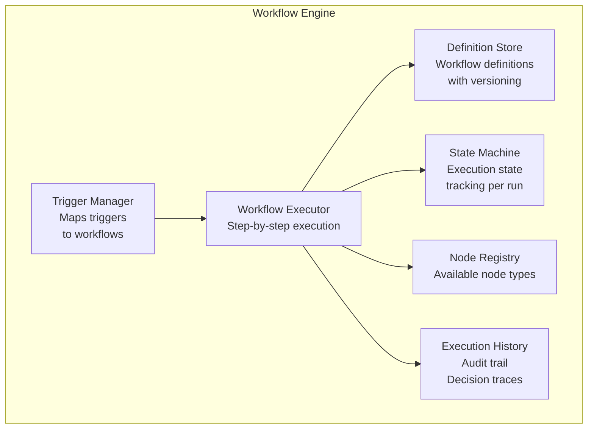
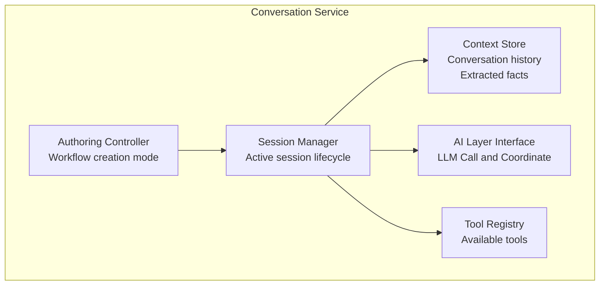
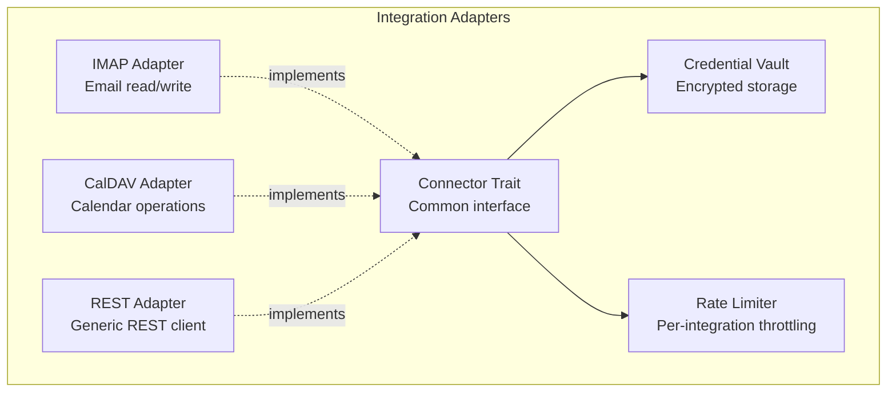
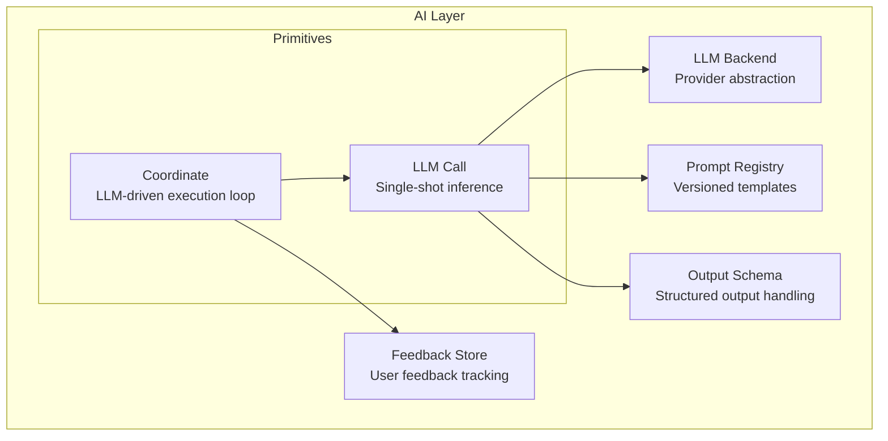
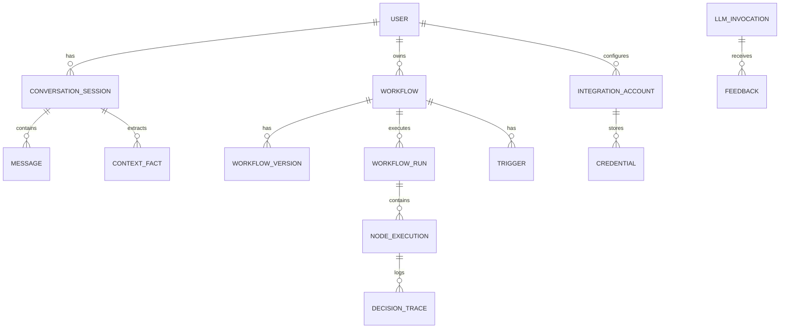

# Technical Architecture

## silver-telegram

**Version**: 0.1.0 (Draft)
**Status**: Initial architecture documentation with many open decisions

---

## Table of Contents

1. [Introduction](#1-introduction)
2. [System Context (C4 Level 1)](#2-system-context-c4-level-1)
3. [Container Diagram (C4 Level 2)](#3-container-diagram-c4-level-2)
4. [Component Diagrams (C4 Level 3)](#4-component-diagrams-c4-level-3)
5. [Data Architecture](#5-data-architecture)
6. [Workflow Definition Format](#6-workflow-definition-format)
7. [Security Architecture](#7-security-architecture)
8. [Deployment Architecture](#8-deployment-architecture)
9. [API Design](#9-api-design)
10. [Observability](#10-observability)
11. [Crate Architecture](#11-crate-architecture)
12. [Architecture Decision Records](#12-architecture-decision-records)
13. [Implementation Roadmap](#13-implementation-roadmap)

---

## 1. Introduction

### 1.1 Purpose

This document describes the technical architecture of silver-telegram, an autonomous personal assistant platform that combines conversational AI with autonomous workflows.

For product requirements, use cases, and detailed capability descriptions, see [PRD.md](../PRD.md).

### 1.2 Audience

- Developers implementing the platform
- Future contributors understanding the system design
- Users wanting to understand how the system works

### 1.3 How to Read C4 Diagrams

This document uses the [C4 model](https://c4model.com/) for visualizing architecture:

- **Level 1 - System Context**: Shows the system as a box surrounded by its users and external systems it interacts with
- **Level 2 - Container**: Zooms into the system to show major deployable units (applications, databases, etc.)
- **Level 3 - Component**: Zooms into a container to show its internal components

Diagrams use [Mermaid](https://mermaid.js.org/) syntax for GitHub rendering.

### 1.4 Document Status

This is a living document. Many architectural decisions are marked as **OPEN** pending design sessions. See [Section 12: Architecture Decision Records](#12-architecture-decision-records) for the status of key decisions.

---

## 2. System Context (C4 Level 1)

The system context shows silver-telegram in relation to its users and external systems.



### 2.1 Users

| User | Description |
|------|-------------|
| **Technical User** | Self-hosts the platform, configures integrations, inspects and modifies workflows, comfortable with configuration files |
| **Power User** | Interacts conversationally, describes automation needs, reviews and approves what gets created |

### 2.2 External Systems

| System | Protocols | Purpose |
|--------|-----------|---------|
| **Email Providers** | IMAP, JMAP, SMTP | Read and send email |
| **Calendar Services** | CalDAV, REST APIs | Query and manage calendar events |
| **Task Managers** | Various REST APIs | Task management integration |
| **LLM Providers** | HTTP APIs | Execute AI primitives (local via Ollama or cloud APIs) |
| **Webhook Sources** | HTTP webhooks | External event triggers for workflows |

---

## 3. Container Diagram (C4 Level 2)

The container diagram shows the major deployable/runnable components within silver-telegram.



### 3.1 Container Descriptions

| Container | Technology | Responsibility |
|-----------|------------|----------------|
| **Web Application** | Leptos/Axum (Rust) | User interface via SSR + WASM hydration |
| **Conversation Service** | Rust | Manages conversation sessions, context, AI primitive orchestration |
| **Workflow Engine** | Rust | Executes workflows, manages state machines, handles step execution |
| **Integration Adapters** | Rust | Protocol-specific adapters for external services |
| **Scheduler** | Rust | Manages scheduled triggers, handles missed executions |
| **Database** | **TBD** | Persistent storage for workflows, state, history, credentials |
| **Event Bus** | **TBD** | Internal async communication between components |

---

## 4. Component Diagrams (C4 Level 3)

### 4.1 Workflow Engine Components



| Component | Responsibility |
|-----------|----------------|
| **Definition Store** | Persists workflow definitions with version history |
| **Workflow Executor** | Executes workflows step-by-step, advancing through nodes |
| **State Machine** | Tracks execution state for each workflow run |
| **Node Registry** | Registry of available node types (AI layer, integrations, control flow) |
| **Trigger Manager** | Connects triggers (schedule, event, manual) to workflows |
| **Execution History** | Audit trail of all executions, inputs, outputs, decisions |

> **OPEN**: Workflow representation format requires a separate design session. Workflows are graphs of nodes with inputs/outputs. See [PRD Section 8.2](../PRD.md#82-workflow-representation).

### 4.2 Conversation Service Components



| Component | Responsibility |
|-----------|----------------|
| **Session Manager** | Manages active conversation session lifecycle |
| **Context Store** | Stores conversation history and extracted context |
| **AI Layer Interface** | Interface to AI primitives (LLM Call, Coordinate) |
| **Tool Registry** | Registry of tools available during conversation |
| **Authoring Controller** | Handles workflow creation from conversation |

> **OPEN**: Context persistence strategy (PRD 8.1) - how much context persists across sessions?

### 4.3 Integration Framework Components



| Component | Responsibility |
|-----------|----------------|
| **Connector Trait** | Common interface all integrations implement |
| **IMAP Adapter** | Email read/write via IMAP protocol |
| **CalDAV Adapter** | Calendar operations via CalDAV |
| **REST Adapter** | Generic REST client for arbitrary APIs |
| **Credential Vault** | Encrypted storage for integration credentials |
| **Rate Limiter** | Per-integration rate limiting to respect external API constraints |

### 4.4 AI Layer Components



#### Fundamental Primitives

There are two architecturally distinct AI primitives:

| Primitive | Nature | Description |
|-----------|--------|-------------|
| **LLM Call** | Single-shot inference | Context + prompt + optional output schema → output |
| **Coordinate** | LLM-driven loop | Goal → (decide actions → execute → evaluate) → repeat until done |

**LLM Call** is stateless, single-shot inference. The LLM receives context and a prompt, optionally constrained by an output schema, and produces a response.

**Coordinate** is an iterative process where the LLM controls execution flow:
1. LLM evaluates context and goal
2. LLM decides what operations to run (and how many)
3. Operations execute (tools, sub-workflows, integrations)
4. LLM evaluates results
5. LLM decides: done, or more operations needed?
6. Repeat until done

The key distinction: in Coordinate, the LLM decides the control flow dynamically, not just producing output. It can invoke multiple rounds of operations, reacting to results of previous rounds.

#### Workflow Node Types

The PRD describes several user-facing operations (Classify, Generate, Summarize, Extract, Score, Deduplicate, Decide). These are **workflow node types**, not distinct primitives. They are all built on **LLM Call** with different configurations:

| Node Type | Implementation |
|-----------|----------------|
| **Classify** | LLM Call with prompt asking to categorize, output schema = {category, confidence} |
| **Generate** | LLM Call with free-form output |
| **Summarize** | LLM Call with prompt asking for condensation |
| **Extract** | LLM Call with prompt asking to pull out data, output schema = user-defined structure |
| **Score** | LLM Call with output schema = numeric value |
| **Deduplicate** | LLM Call with output schema = boolean |
| **Decide** | LLM Call with prompt asking to select, output schema = one of the provided options |

These node types provide semantic clarity in workflow definitions and can have specialized prompt templates, but they share the same underlying LLM Call primitive.

#### Supporting Components

| Component | Responsibility |
|-----------|----------------|
| **LLM Backend** | Provider abstraction (local Ollama, cloud APIs) |
| **Prompt Registry** | Versioned prompt templates for node types |
| **Output Schema** | Structured output handling (JSON schema constraints) |
| **Feedback Store** | User feedback on AI outputs for improvement |

---

## 5. Data Architecture

### 5.1 Core Entities



### 5.2 Entity Descriptions

| Entity | Description |
|--------|-------------|
| **User** | Platform user account |
| **Conversation Session** | A conversation instance with message history |
| **Message** | Individual message in a conversation |
| **Context Fact** | Extracted fact or preference from conversation |
| **Workflow** | A defined automation |
| **Workflow Version** | Version history for a workflow |
| **Workflow Run** | Single execution of a workflow |
| **Trigger** | What initiates a workflow (schedule, event, manual) |
| **Node Execution** | Execution record for a single node in a run |
| **Decision Trace** | Explanation of LLM decision (for Coordinate loops and complex calls) |
| **Integration Account** | Configured external service connection |
| **Credential** | Encrypted credential for an integration |
| **LLM Invocation** | Record of an LLM Call or Coordinate execution |
| **Feedback** | User feedback on LLM output |

### 5.3 Open Questions

> **OPEN**: Multi-user data model approach (PRD 8.9) - should the data model support user isolation from the start?

> **OPEN**: Retention policies (PRD 8.6) - what persists, for how long?

---

## 6. Workflow Definition Format

> **REQUIRES SEPARATE DESIGN SESSION**

Workflows are graphs of nodes with inputs/outputs. The detailed representation format requires dedicated design work before implementation.

### 6.1 Key Concepts

- **Nodes**: Individual operations (AI primitives, integrations, control flow)
- **Edges**: Data flow connections between nodes
- **Inputs/Outputs**: Typed data flowing through the graph
- **Triggers**: What initiates the workflow

### 6.2 Design Considerations

From [PRD Section 8.2](../PRD.md#82-workflow-representation):

- Must be inspectable (user can understand what it does)
- Should be version-controllable (diffable, mergeable)
- Authoring agent needs to produce it
- User may need to edit it manually

### 6.3 Workflow Execution Patterns

The workflow engine (not the Coordinate AI primitive) handles these static execution patterns:

| Pattern | Description | Example |
|---------|-------------|---------|
| **Sequential** | A then B then C | Fetch email → Classify → Generate response |
| **Parallel** | A, B, C concurrently, wait for all | Search flights + Search hotels + Search events |
| **Fan-out/fan-in** | Spawn N instances, aggregate results | Process each email in inbox |
| **Conditional** | Route based on condition | If urgent → notify; else → queue |

These are defined in the workflow graph structure and executed by the workflow engine.

**Distinct from Coordinate**: The Coordinate AI primitive (see [Section 4.4](#44-ai-layer-components)) handles *dynamic* orchestration where the LLM decides at runtime what to execute, how many rounds, and when to stop. Static patterns above are graph structure; Coordinate is LLM-controlled execution.

> **OPEN**: Execution pattern implementation depends on workflow graph design.

---

## 7. Security Architecture

### 7.1 Authentication

- **OIDC**: OpenID Connect for user authentication
- Single sign-on support with external identity providers

### 7.2 Credential Storage

- All integration credentials encrypted at rest
- No plaintext credentials in configuration or logs
- Credentials isolated per user

### 7.3 Audit Logging

- All access to sensitive data logged
- Workflow executions include full audit trail
- AI primitive decisions traceable

### 7.4 Design Principles

From [PRD Section 6.2](../PRD.md#62-privacy-and-security):

| Requirement | Description |
|-------------|-------------|
| Data Locality | All data stays on user infrastructure by default |
| Credential Security | Encrypted storage, no plaintext credentials |
| Minimal Permissions | Request only needed access scopes |
| No Telemetry | No data sent to platform developers |
| Audit Logging | Track all access to sensitive data |

---

## 8. Deployment Architecture

> **OPEN**: Deployment topology (single-node vs distributed) is not yet decided.

### 8.1 Design Considerations

From [PRD Section 6.1](../PRD.md#61-deployment):

| Requirement | Description |
|-------------|-------------|
| Self-Hosted | Runs entirely on user-controlled infrastructure |
| Single-Node Viable | Must work on single server (home lab use case) |
| Containerized | Standard container deployment |
| Offline Capable | Core functionality works without internet (local models) |
| Resource Efficient | Reasonable footprint when idle |

### 8.2 Open Questions

- Container/packaging strategy (TBD)
- Volume and persistence strategy (TBD)
- Multi-node scaling approach (if needed)

---

## 9. API Design

### 9.1 Web UI API

- **Leptos server functions** provide the API for the web UI
- Automatic RPC stub generation for client-side calls
- Type-safe communication between server and WASM client

### 9.2 General API

> **OPEN**: General API design (REST, GraphQL, etc.) is not yet decided.

Considerations:
- API-first design per [PRD Section 6.4](../PRD.md#64-extensibility)
- All functionality should be accessible via API
- Support for external tooling and scripting

### 9.3 Webhook Endpoints

> **TBD**: Design for webhook ingestion for external triggers.

### 9.4 Admin/Observability Endpoints

> **TBD**: Design for administrative and monitoring endpoints.

---

## 10. Observability

### 10.1 Structured Logging

- **`tracing`** crate for structured logging
- Span-based tracing for request flows
- Environment-based log level filtering

### 10.2 Decision Traces

- LLM invocations record reasoning
- Coordinate loops record each iteration's decisions and actions
- Outputs traceable to prompts, context, and output schemas

### 10.3 Health Checks

- Readiness and liveness endpoints
- Integration connectivity status
- Database connection health

### 10.4 Metrics

From [PRD Section 5.8](../PRD.md#58-observability):

| Metric Category | Examples |
|-----------------|----------|
| Execution | Workflow completion rate, error rate, latency |
| AI Layer | LLM call latency, Coordinate iteration counts, output quality signals |
| Resources | Memory usage, database size, queue depth |

---

## 11. Crate Architecture

### 11.1 Current Structure

```
silver-telegram/
├── lib/
│   └── core/              # Domain types, errors
│       └── src/
│           ├── lib.rs
│           └── error.rs
└── bin/
    └── server/            # Leptos web application
        └── src/
            ├── main.rs    # Axum server entry
            ├── lib.rs     # WASM hydration entry
            └── app.rs     # Leptos App component
```

### 11.2 Future Structure

> Future crate structure deferred until workflow graph design is complete.

Potential crates (pending design):
- `workflow-engine` - Workflow execution
- `conversation` - Conversation management
- `ai` - AI layer (LLM Call, Coordinate, LLM backend abstraction)
- `integrations` - Integration framework and adapters
- `scheduler` - Trigger scheduling

---

## 12. Architecture Decision Records

**No ADRs finalized yet.** This section will document key architectural decisions as they are made.

### 12.1 Pending Decisions

| Decision | Status | Notes |
|----------|--------|-------|
| Database choice | **OPEN** | |
| Deployment topology | **OPEN** | Single-node vs distributed |
| Multi-user data model | **OPEN** | User indicated preference for multi-user aware |
| Event bus / message queue | **OPEN** | In-process vs external |
| General API design | **OPEN** | REST, GraphQL, etc. |
| Workflow representation format | **OPEN** | Requires separate design session |
| Context persistence strategy | **OPEN** | Cross-session context handling |

### 12.2 PRD Open Questions Mapping

| PRD Section | Question | Status |
|-------------|----------|--------|
| 8.1 | Conversational Context | **OPEN** |
| 8.2 | Workflow Representation | **REQUIRES SEPARATE DESIGN** |
| 8.3 | Graduation Criteria | **OPEN** |
| 8.4 | AI Primitive Boundaries | **N/A** - per-node configuration |
| 8.5 | Workflow Execution Patterns | **OPEN** - depends on workflow design |
| 8.6 | State and Memory | **OPEN** |
| 8.7 | Feedback Granularity | **OPEN** |
| 8.8 | Learning Mechanisms | **OPEN** |
| 8.9 | Multi-User | **OPEN** |

---

## 13. Implementation Roadmap

High-level phases (no time estimates). Actual order depends on design session outcomes.

### Phase 1: Foundation

- Core domain types in `lib/core`
- Database schema (once database choice is made)
- Basic workflow engine structure

### Phase 2: Conversation

- Session management
- AI layer (LLM Call, Coordinate primitives)
- LLM backend integration

### Phase 3: Workflows

- Full workflow execution (after representation design)
- Scheduling and triggers
- State persistence

### Phase 4: Integrations

- Integration framework (Connector trait)
- First integration adapter

### Phase 5: Graduation

- Meta-workflow for pattern recognition
- Authoring assistance

---

## References

- [Product Requirements Document](../PRD.md)
- [C4 Model](https://c4model.com/)
- [Mermaid Diagrams](https://mermaid.js.org/)
